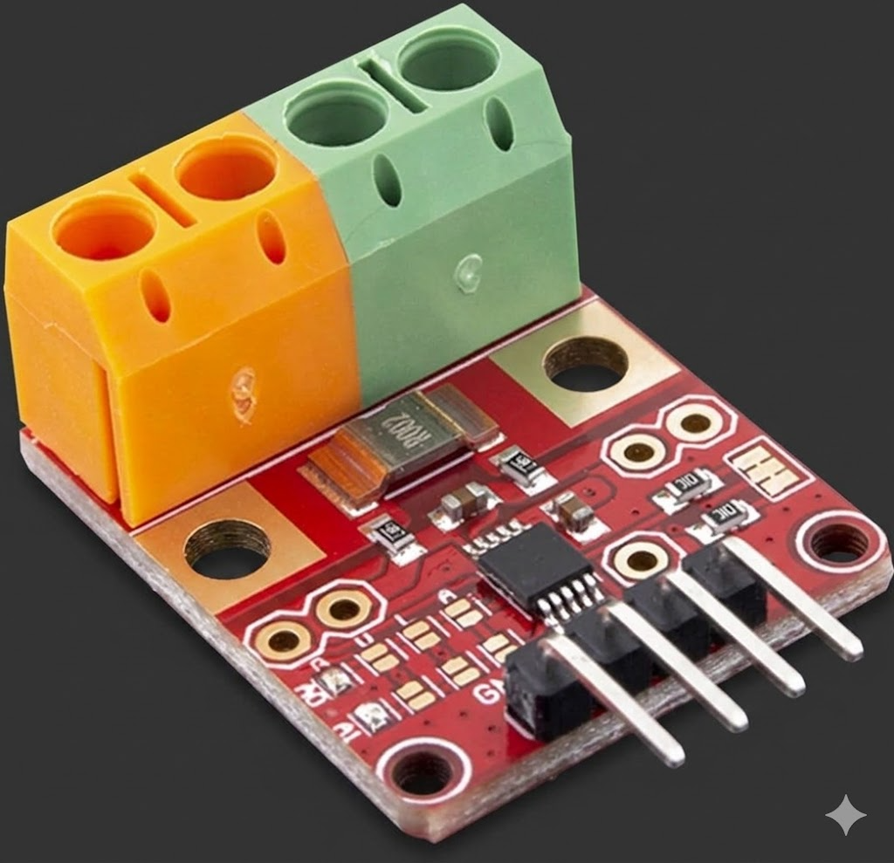

# ina228



Platform-agnostic, `no_std` Rust driver for the [TI INA228](https://www.ti.com/product/INA228) high-side power/energy/charge monitor, built on [`embedded-hal`](https://crates.io/crates/embedded-hal) 1.0.

The INA228 measures bus voltage (0-85V), shunt voltage, current, power, energy, and charge over I2C with 20-bit ADC resolution.

## Installation

```toml
[dependencies]
ina228 = "0.1"
```

## Usage

```rust
use ina228::{Ina228, OperatingMode, ConversionTime, AveragingCount, DEFAULT_ADDRESS};

let mut ina = Ina228::new(i2c, DEFAULT_ADDRESS);

// Configure: continuous bus+shunt+temp, 1052µs conversion, 64x averaging
ina.configure(
    OperatingMode::ContinuousAll,
    ConversionTime::Us1052,
    ConversionTime::Us1052,
    ConversionTime::Us1052,
    AveragingCount::N64,
).unwrap();

// Calibrate for 10A max expected current, 2mΩ shunt resistor
ina.calibrate(10.0, 0.002).unwrap();

// Wait for conversion and read
while !ina.conversion_ready().unwrap() {
    // sleep or yield here
}
let voltage = ina.bus_voltage().unwrap();
let current = ina.current().unwrap();
let power = ina.power().unwrap();
let temp = ina.die_temperature().unwrap();
```

## Features

- `no_std` compatible — works on any platform with `embedded-hal` 1.0 I2C
- Bus voltage, shunt voltage, current, power, energy, and charge measurements
- Configurable ADC conversion time and averaging
- Two shunt voltage ranges: ±163.84mV and ±40.96mV
- Alert thresholds for shunt/bus voltage, temperature, and power
- Diagnostic flags for overflow and limit detection
- Shunt temperature compensation
- Energy and charge accumulators with reset

## Calibration

Call `calibrate(max_current_a, shunt_resistance_ohm)` before reading current, power, energy, or charge. The `max_current_a` parameter sets the measurement resolution — use the maximum current your load will draw, not the theoretical maximum of the shunt.

If you change the ADC range via `set_adc_range()` after calling `calibrate()`, the SHUNT_CAL register is automatically recalculated.

## I2C Addresses

The INA228 supports 16 addresses (0x40-0x4F) configured via A0 and A1 pins:

| A1  | A0  | Address |
|-----|-----|---------|
| GND | GND | 0x40    |
| GND | VS  | 0x41    |
| GND | SDA | 0x42    |
| GND | SCL | 0x43    |
| VS  | GND | 0x44    |
| VS  | VS  | 0x45    |
| VS  | SDA | 0x46    |
| VS  | SCL | 0x47    |
| SDA | GND | 0x48    |
| SDA | VS  | 0x49    |
| SDA | SDA | 0x4A    |
| SDA | SCL | 0x4B    |
| SCL | GND | 0x4C    |
| SCL | VS  | 0x4D    |
| SCL | SDA | 0x4E    |
| SCL | SCL | 0x4F    |

## ESP32-C3 Example

A complete ESP32-C3 example is in [`examples/esp32/`](examples/esp32/). It requires the ESP-IDF Rust toolchain and an ESP32-C3 with an INA228 connected via I2C (GPIO8 SDA, GPIO9 SCL).

```sh
cd examples/esp32
cargo run --release
```

## License

Licensed under either of [Apache License, Version 2.0](http://www.apache.org/licenses/LICENSE-2.0) or [MIT license](http://opensource.org/licenses/MIT) at your option.
