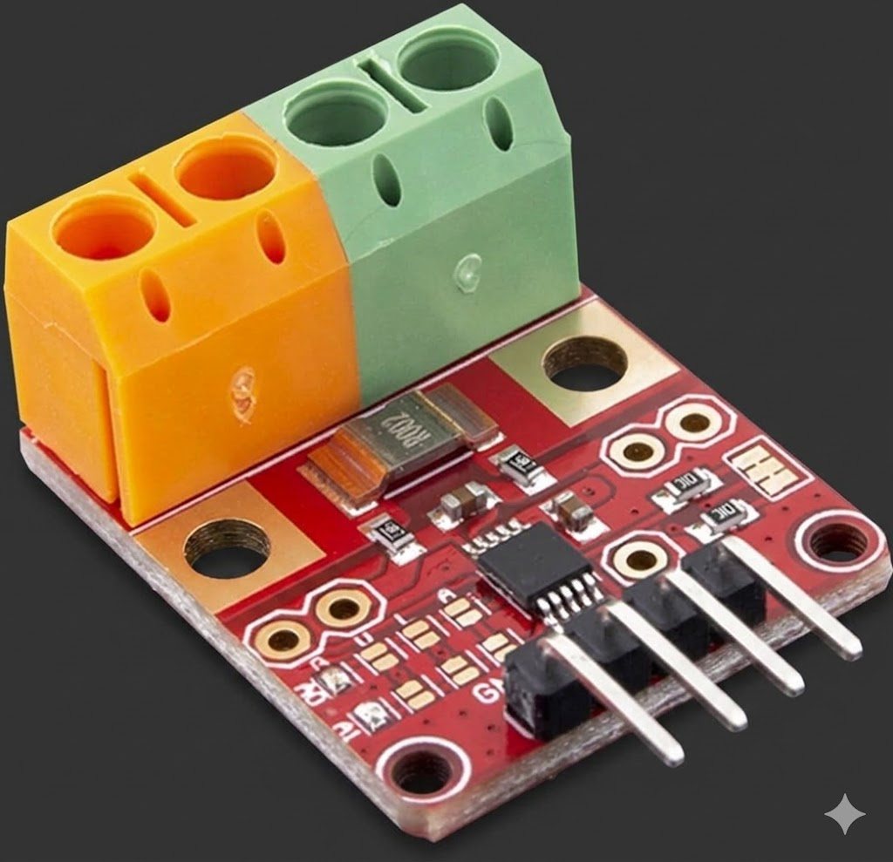

# ina228



Platform-agnostic, `no_std` Rust driver for the [TI INA228](https://www.ti.com/product/INA228) high-side power/energy/charge monitor, built on [`embedded-hal`](https://crates.io/crates/embedded-hal) 1.0.

The INA228 measures bus voltage (0-85V), shunt voltage, current, power, energy, and charge over I2C with 20-bit ADC resolution.

## Installation

```toml
[dependencies]
ina228 = "0.2"
```

## Usage

```rust
use ina228::{
    AdcConfig, AveragingCount, Ina228, DEFAULT_ADDRESS,
};

let mut ina = Ina228::new(i2c, DEFAULT_ADDRESS)
    .unwrap_or_else(|_| panic!("failed to read INA228 CONFIG"));

// Configure: continuous bus+shunt+temp, 1052µs conversion, 64x averaging
ina.configure(AdcConfig {
    averaging: AveragingCount::N64,
    ..Default::default()
})
.unwrap();

// Calibrate for 10A max expected current, 2mΩ shunt resistor
ina.calibrate(10.0, 0.002).unwrap();

// Polling acknowledges every snapshot; production code must handle every returned flag.
loop {
    let flags = ina.take_diagnostic_flags().unwrap();
    if flags.conversion_ready {
        break;
    }
}
let voltage = ina.bus_voltage().unwrap();
let current = ina.current().unwrap();
let power = ina.power().unwrap();
let temp = ina.die_temperature().unwrap();
```

## Features

- `no_std` compatible — works on any platform with `embedded-hal` 1.0 I2C
- Bus voltage, shunt voltage, current, power, energy, and charge measurements
- Configurable ADC conversion time and averaging
- Two shunt voltage ranges: ±163.84mV and ±40.96mV
- Alert thresholds for shunt/bus voltage, temperature, and power
- Diagnostic flags for overflow and limit detection
- Shunt temperature compensation
- Energy and charge accumulators with reset

## Calibration

Call `calibrate(max_current_a, shunt_resistance_ohm)` before reading current, power, energy, or charge. The `max_current_a` parameter sets the measurement resolution — use the maximum current your load will draw, not the theoretical maximum of the shunt. Its product with `shunt_resistance_ohm` must stay strictly below the selected ADC range's positive full-scale voltage.

Calibrating resets ENERGY, CHARGE, and MATHOF, and resets PWR_LIMIT to its least-restrictive `0xFFFF` because the watt value of a raw threshold moves with `CURRENT_LSB` — call `set_power_limit()` again if you need a power alert. Changing the range with `set_adc_range()` recalculates SHUNT_CAL for you, but clears the shunt over- and under-voltage thresholds, whose register scale depends on the range.

## Contract

Three rules apply across the API:

- **Freshness.** No method waits for a conversion, and the driver tracks no per-channel readiness. Output registers hold the last completed result, so after a reset, configuration, calibration, range, or temperature-compensation change, poll `take_diagnostic_flags()` for `conversion_ready` from a mode that converts every channel you intend to read — conversion-ready from a bus-only mode does not make VSHUNT current.
- **Suspend and restore.** Methods that change scaling suspend conversions and restore the previous ADC configuration whether or not the work between them succeeds, so a failure cannot leave the ADC shut down. Restoring a running mode starts a fresh conversion and clears conversion-ready; a mode that was already shut down stays shut down, so call `configure()` first.
- **Fail-stop.** An I2C write error does not prove whether the INA228 accepted the value. After one, do not continue with scaled operations: recover with `reset()`, or release the bus and construct a new `Ina228`, which reads the live ADC range. Failed reads can be retried.

`take_diagnostic_flags()` acknowledges DIAG_ALRT, including conversion-ready and any latched threshold alerts. `take_accumulator_snapshot()` works only in continuous modes, where TI defines ENERGY and CHARGE as valid; it suspends conversions so the three reads are coherent, leaving a short gap where nothing accumulates, and returns the diagnostic state captured before its own reads cleared it. Reading leaves the accumulated values alone — only `reset_accumulators()` clears those — but it does consume flag state: DIAG_ALRT's conversion-ready and latched alerts, and the ENERGY and CHARGE overflow indicators. A capture that fails mid-read loses whichever of those its completed reads already took.

Fallible methods return `Error<I2C::Error>`: `Error::InvalidConfiguration` for unrepresentable physical values and accumulator reads outside continuous mode, `Error::I2c` for bus failures. Thresholds round to the nearest register value. `take_accumulator_snapshot()` returns `CaptureError` instead, so that a capture which completed but could not resume conversions is handed back with its snapshot rather than dropped — the reads that produced it already consumed the device's flag state.

`Ina228::new()` reads CONFIG so the driver picks up the ADC range already active in the device. It rejects addresses outside `0x40..=0x4F` with `InitializationError::InvalidAddress` and reports read failures with `InitializationError::I2c`; both return ownership of the I2C bus. `reset()` does not delay — wait at least 300 µs for oscillator and ADC stability. `AdcConfig::default()` matches the datasheet ADC_CONFIG reset value: continuous conversion of all channels, 1052 µs conversion times, one-sample averaging.

## I2C Addresses

The INA228 supports 16 addresses (0x40-0x4F) configured via A0 and A1 pins:

| A1  | A0  | Address |
|-----|-----|---------|
| GND | GND | 0x40    |
| GND | VS  | 0x41    |
| GND | SDA | 0x42    |
| GND | SCL | 0x43    |
| VS  | GND | 0x44    |
| VS  | VS  | 0x45    |
| VS  | SDA | 0x46    |
| VS  | SCL | 0x47    |
| SDA | GND | 0x48    |
| SDA | VS  | 0x49    |
| SDA | SDA | 0x4A    |
| SDA | SCL | 0x4B    |
| SCL | GND | 0x4C    |
| SCL | VS  | 0x4D    |
| SCL | SDA | 0x4E    |
| SCL | SCL | 0x4F    |

## ESP32-C6 hardware test suite

The hardware test suite in [`examples/esp32-c6-test-suite/`](examples/esp32-c6-test-suite/) exercises representative driver behavior against an INA228 connected to an ESP32-C6, including identification, reset, both ADC ranges, calibration, measurements, temperature compensation, accumulators, diagnostics, thresholds, and the ALERT pin. Exhaustive register-encoding coverage remains in the host tests. See the suite README for fixture requirements and hardware-validation limits.

```sh
cargo run --manifest-path examples/esp32-c6-test-suite/Cargo.toml --release
```

## License

Licensed under either of [Apache License, Version 2.0](http://www.apache.org/licenses/LICENSE-2.0) or [MIT license](http://opensource.org/licenses/MIT) at your option.
